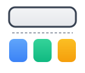

<div align="right"><a href="README.md">中文</a></div>

<div align="center"></div>

# subagent-isolation

<div align="center">

[]()
[]()
[](https://www.npmjs.com/package/subagent-isolation)
[](LICENSE)

</div>

The main agent can't touch code. No `write`, no `edit`, no `bash`. It only has four read-only tools — `read`, `grep`, `find`, `ls` — plus a `subagent` tool for delegation. All file changes, shell commands, and execution logic go to subagents. Each subagent runs in its own `pi` process with its own system prompt and skills. No shared state between the main agent and subagents, or between subagents.

**subagent-isolation** is an extension for [Pi Agent](https://github.com/earendil-works/pi). Pi already supports subagents. This extension adds one constraint — **it strips the main agent of execution tools and enforces isolation**. The main agent becomes a planner and observer, nothing more.

---

## Why this matters

A model's effective context is not unlimited. When one agent reads code, edits files, and runs tests all at once, tool traces, errors, and intermediate results pile up fast. Once total context exceeds the threshold the model can handle reliably, reasoning quality drops — key details get drowned, work gets repeated, and decisions are made from noisy context.

The point of a subagent system is to split that ever-growing context into smaller pieces. Each agent handles only its own slice, so no single conversation is dragged down by historical noise.

## How this differs from plain subagents

Many subagent implementations are just “spawn a tool call inside the main agent.” The subagent still reuses the main agent's prompt and skills, and the main agent still keeps write and shell access — isolation is optional and partial.

subagent-isolation enforces complete isolation:

- **Process isolation**: every subagent starts in its own `pi` process.
- **Prompt isolation**: each subagent has its own agent definition file (e.g., `coder.md`), not the main agent's `master.md`.
- **Skill isolation**: the main agent and each subagent load only their own skills, with no cross-contamination.
- **Execution isolation**: the main agent loses `write`, `edit`, and `bash`; it can only delegate.
- **Independent configuration**: each agent defines its own `tools` and `skills`, controlling exactly what it can and cannot do.

Plain subagents split work. subagent-isolation splits everything.

---

## Before / After

| Before | After |
|--------|-------|
| One agent plans and executes; context growth degrades reasoning | Main agent only plans and delegates; each subagent handles its own slice |
| Main agent keeps write and shell access; isolation is partial | Main agent loses `write`, `edit`, and `bash`; subagents run in isolated processes |
| All skills and tools pile up in one agent and interfere | Each subagent loads only the skills and tools it needs |

---

## Core design

| Role | Responsibility | Where it runs |
|------|----------------|---------------|
| Main agent | Understand requests, split tasks, delegate, and summarize | Your main `pi` session |
| Subagent | Read, edit, run checks, and return results | Isolated `pi --mode json` process |

A typical task flows like this:

1. You describe the task to the main agent.
2. The main agent uses the `subagent` tool to spawn an isolated `pi` process.
3. The subagent receives only the delegated task and its own config, then performs the work.
4. The subagent returns its result and exits; the main agent decides what's next.

Four levels of isolation:

- **Process isolation**: every subagent spawns a fresh `pi --mode json` process. Its system prompt is written to a temp file and injected via `--append-system-prompt`, so subagents never pollute each other.
- **Context isolation**: the subagent sees only the task you delegated, not the tool-call trail from the main agent.
- **Capability isolation**: the `tools` and `skills` fields give each subagent a precise, minimal toolbox.
- **Recursion boundary**: subagents can be configured to prevent further delegation, keeping task scope manageable.

---

## Prerequisites: install Pi Agent

subagent-isolation is a Pi Package, so you need Pi Agent first.

This extension requires Node.js >= 20 (matching `engines.node` in `package.json`).

### Option 1: one-line install (recommended for Linux / macOS)

```bash
curl -fsSL https://pi.dev/install.sh | sh
```

### Option 2: install via npm globally

```bash
npm install -g --ignore-scripts @earendil-works/pi-coding-agent
```

Once installed, the `pi` command is available in your terminal.

---

## 30-second quick start

### 1. Install the extension

```bash
pi install npm:subagent-isolation
```

### 2. Copy the example agents

The examples already include this configuration. Copy them directly or customize as needed:

```bash
cp examples/pi/agent/agents/*.md ~/.pi/agent/agents/
cp examples/pi/agent/master.md ~/.pi/agent/master.md
cp -r examples/pi/agent/skills/* ~/.pi/agent/skills/
```

See `examples/pi/agent/agents/` for the agent definitions; customize as needed.

Use it as-is, or tweak it to fit your workflow.

### 3. Assign the task in natural language

```bash
pi --tools read,grep,find,ls,subagent \
   --no-skills \
   --append-system-prompt ~/.pi/agent/master.md \
   --skill ~/.pi/agent/skills/brainstorming/
```

This restricts the main agent to read-only tools plus subagent delegation, loads the main agent prompt, and activates the brainstorming skill.

For daily use, add an alias to your shell config. For example, in `~/.zshrc`:

```bash
alias pp='pi --tools read,grep,find,ls,subagent --no-skills --append-system-prompt ~/.pi/agent/master.md --skill ~/.pi/agent/skills/brainstorming/'
```

Then just type `pp` to start the main agent.

Then tell the main agent:

> Refactor the auth middleware to use async/await.

The main agent will automatically call the `coder` subagent via the `subagent` tool. You don't need to write JSON or worry about `sessionId` — the extension handles spawning and cleanup.

If you need to continue the same task, the subagent output ends with a session ID. See [ADVANCED.en.md](ADVANCED.en.md) for the exact format and reuse rules.

---

## Example agents

The GitHub repo ships three ready-to-reference agents in [`examples/pi/agent/agents/`](https://github.com/Wolido/subagent-isolation/tree/main/examples/pi/agent/agents):

| Agent | Purpose | Tools | Skill |
|-------|---------|-------|-------|
| [`coder`](https://github.com/Wolido/subagent-isolation/blob/main/examples/pi/agent/agents/coder.md) | Write, modify, and validate code | `read, write, edit, bash, grep, find, ls` | `systematic-debugging` |
| [`reviewer`](https://github.com/Wolido/subagent-isolation/blob/main/examples/pi/agent/agents/reviewer.md) | Read-only review with actionable feedback | `read, grep, find, ls` | _(none)_ |
| [`writer`](https://github.com/Wolido/subagent-isolation/blob/main/examples/pi/agent/agents/writer.md) | Write docs, READMEs, commit messages | `read, write, edit, grep, find, ls` | `writing-clearly-and-concisely` |

Copy the `.md` files you need into `~/.pi/agent/agents/` (user-scoped) or `.pi/agents/` (project-scoped).

If you have already cloned the repo, copy them directly:

```bash
cp examples/pi/agent/agents/*.md ~/.pi/agent/agents/
```

Or download a single file from GitHub (using `coder` as an example):

```bash
curl -fsSL https://raw.githubusercontent.com/Wolido/subagent-isolation/main/examples/pi/agent/agents/coder.md \
  -o ~/.pi/agent/agents/coder.md
```

> These are examples only. Feel free to modify them or create your own.

Agent discovery rules:

- `user` scope: `~/.pi/agent/agents/`
- `project` scope: `.pi/agents/` (searched upward from the working directory)
- Default merges both scopes; project overrides user on name collisions

---

## Recommended main agent setup

The main agent should be a pure planner: read code, make decisions, delegate tasks. All concrete work — writing files, running commands, editing code — is handled by subagents, each running in its own isolated pi process. This keeps the main agent's context focused on what to do and what came back, rather than being polluted by tool-call traces.

Use `examples/pi/agent/master.md` as the main agent system prompt — copy it to `~/.pi/agent/master.md`.

See examples/pi/agent/master.md for the full example — copy it to ~/.pi/agent/master.md.

Copy the example agents to `~/.pi/agent/agents/`:

```bash
cp examples/pi/agent/agents/*.md ~/.pi/agent/agents/
```

Then start the main agent with:

```bash
pi --tools read,grep,find,ls,subagent \
   --no-skills \
   --append-system-prompt ~/.pi/agent/master.md \
   --skill ~/.pi/agent/skills/brainstorming/
```

What each flag does:

- `--tools read,grep,find,ls,subagent`: read, search, list, and delegate only. No `write`, `edit`, or `bash`, so the main agent cannot modify files or run commands itself.
- `--no-skills`: disables default skill loading to keep the main agent context clean.
- `--append-system-prompt ~/.pi/agent/master.md`: appends the main agent system prompt to the default prompt.
- `--skill ~/.pi/agent/skills/brainstorming/`: loads the brainstorming skill for task planning.

If you only want them for the current project, place them in `.pi/agents/`; the extension will load these project-level agents when invoking `subagent`.

---

## Per-subagent model configuration

Different subagents suit different models. If your main agent defaults to Kimi K3 ($3/$15 per M token), running `coder`, `writer`, and `reviewer` all on Kimi K3 gets expensive fast. `coder` needs strong reasoning — use DeepSeek V4 Pro ($0.44/$0.87, great value). `writer` and `reviewer` handle lighter tasks — DeepSeek V4 Flash ($0.14/$0.28) is the cheapest and works fine. Reserve the expensive model for the main agent's planning.

### Configuration file

Use `subagent-isolation.json` to assign a model per subagent:

- **User-level**: `~/.pi/agent/subagent-isolation.json`
- **Project-level**: `.pi/subagent-isolation.json` (searched upward from the working directory)

The file is a JSON key-value map. Key = agent name, value = model string:

```json
{
  "coder": "deepseek/deepseek-v4-pro",
  "writer": "deepseek/deepseek-v4-flash",
  "reviewer": "deepseek/deepseek-v4-flash"
}
```

With this setup, the main agent still uses the default Kimi K3 for planning and decisions. `coder` uses DeepSeek V4 Pro for code changes. `writer` and `reviewer` use the cheapest DeepSeek V4 Flash. Overall cost drops significantly — most work runs on cheap models, and only planning and complex reasoning hit the expensive one.

### Priority

Model selection priority (highest to lowest):

1. `subagent-isolation.json` configuration
2. Agent frontmatter `model` field
3. Inherit from the parent agent

### Merge rules

Project-level configuration overrides user-level keys of the same name. For example, if user-level sets `coder` to `deepseek/deepseek-v4-pro` and project-level sets `coder` to `kimi-coding/k3`, the project uses Kimi K3.

---

## Architecture and workflow

1. The user makes a request.
2. The main agent breaks it down and picks the right subagent.
3. The `subagent` tool spawns an isolated `pi` process for that subagent.
4. The subagent executes with a clean context and only the selected tools/skills.
5. The subagent returns its result and exits; the main agent summarizes and continues.

The main agent keeps only "what to do" and "what happened." All intermediate tool-call noise stays inside the subagent process. The more complex the task, the bigger the win.

---

## Example skills

The GitHub repo ships three ready-to-use skills in [`examples/pi/agent/skills/`](https://github.com/Wolido/subagent-isolation/tree/main/examples/pi/agent/skills):

| Skill | Used by | Description |
|-------|---------|-------------|
| [`brainstorming`](https://github.com/Wolido/subagent-isolation/tree/main/examples/pi/agent/skills/brainstorming) | Main agent | Turn ideas into fully formed designs through collaborative dialogue |
| [`systematic-debugging`](https://github.com/Wolido/subagent-isolation/tree/main/examples/pi/agent/skills/systematic-debugging) | `coder` | Find root cause before attempting any fix (4-phase process) |
| [`writing-clearly-and-concisely`](https://github.com/Wolido/subagent-isolation/tree/main/examples/pi/agent/skills/writing-clearly-and-concisely) | `writer` | Refine prose with clarity rules, AI-pattern detection, and voice injection |

Copy them to `~/.pi/agent/skills/`:

```bash
mkdir -p ~/.pi/agent/skills
cp -r examples/pi/agent/skills/brainstorming ~/.pi/agent/skills/
cp -r examples/pi/agent/skills/systematic-debugging ~/.pi/agent/skills/
cp -r examples/pi/agent/skills/writing-clearly-and-concisely ~/.pi/agent/skills/
```

Skills can be loaded in two ways:

- **Subagents**: declare in the `skills:` frontmatter field (e.g. coder's `skills: systematic-debugging`). Pi loads them automatically when spawning the subagent.
- **Main agent**: load via the `--skill` CLI flag (e.g. `--skill ~/.pi/agent/skills/brainstorming/`).

Skill discovery mirrors agent discovery: `~/.pi/agent/skills/` (user scope) and `.pi/skills/` (project scope). Pi resolves skill names in the `skills:` field against these directories.

---

## Advanced usage

If you need to construct `subagent` calls manually, reuse a `sessionId`, view the full frontmatter fields, or tune environment variables, see [ADVANCED.en.md](ADVANCED.en.md).

---

## Project structure

- `src/index.ts` — main extension source
- `examples/pi/agent/` — example agent and skill definitions
  - `master.md` — main agent system prompt
  - `agents/` — subagent definitions
  - `skills/` — skill definitions
- `package.json` — npm package manifest
- `tsconfig.json` — TypeScript configuration
- `README.md` / `README.en.md` — documentation
- `LICENSE` — MIT license

---

## License

MIT
